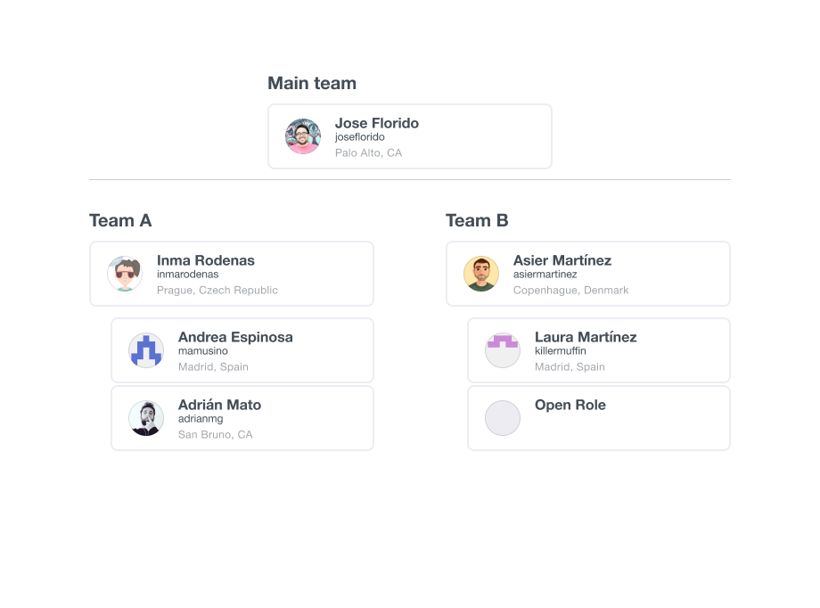
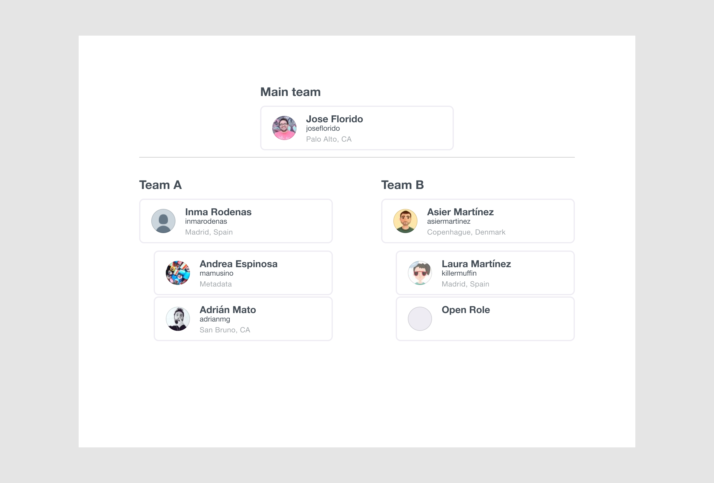
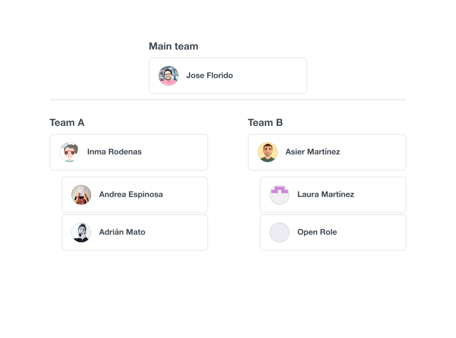
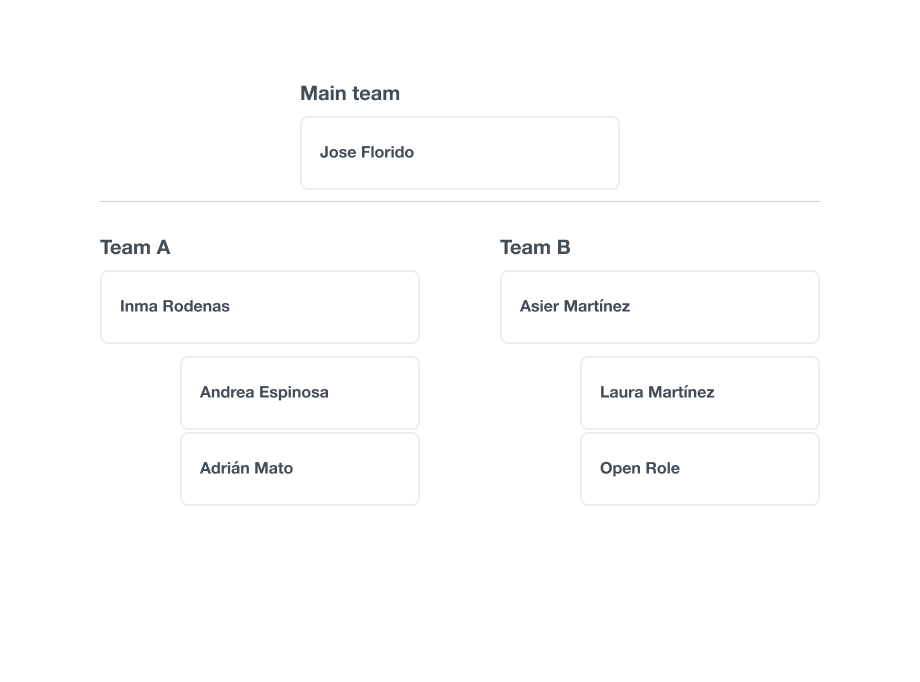
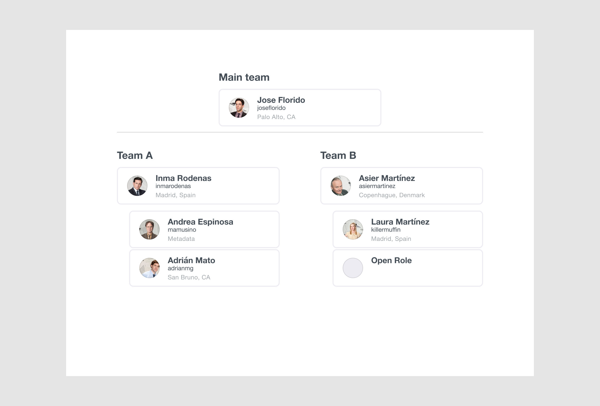
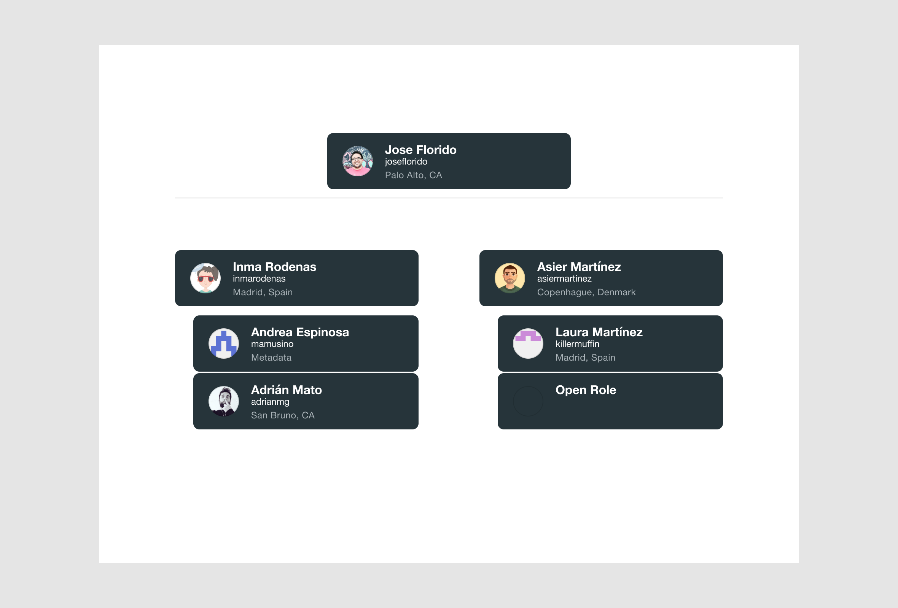
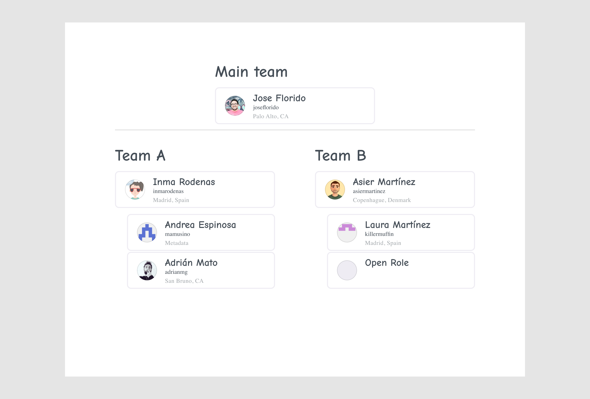
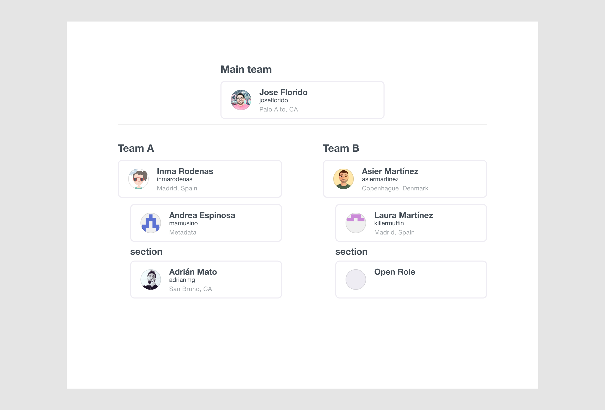

# Orgchart – a figma plugin

Create an org chart in Figma from a JSON or a YAML file.

## Run the plugin locally

- Clone the repository: `git clone https://github.com/mamuso/figma-orgchart.git`
- Go to the directory: `cd figma-orgchart`
- Install dependencies: `npm i`
- Build the plugin: `npm run watch`
- In the Figma desktop app, open a Figma document, and go to `Plugins > Development > Import plugin from manifest`
- Select the `figma-orgchart/manifest.json` file

If you run the plugin locally, you can edit `src/defautChartData.json` to change the default chart data.

## JSON/YAML data

You need to provide a JSON or a YAML with your team structure. You can use the following keys:

- `team`: name of the team
- `manager`: will be represented at the top of the team
- `members`: array of members of a team
- `teams`: array of teams
- `section`: it will create a label with the text that you provide

Each manager and member can have the following keys:

- `name`: name of the person
- `alias`: title alias of the person. By default, it will expect a GitHub alias and will try to fill the avatar
- `meta`: additional information that you'll like to provide
- `avatar`: you can override the avatar providing a URL of an image

## Aditional configurations

By default, the plugin assumes the following configuration:

```json
{
  "avatar": true,
  "name": true,
  "alias": true,
  "meta": true,
  "ogurl": "https://github.com/",
  "color": {
    "border": "EEECF3",
    "background": "FFFFFF",
    "primarytext": "444D56",
    "secondarytext": "A1A6AA"
  },
  "text": {
    "label": { "family": "Helvetica Neue", "style": "Bold", "size": 20 },
    "section": { "family": "Helvetica Neue", "style": "Bold", "size": 18 },
    "name": { "family": "Helvetica Neue", "style": "Bold", "size": 16 },
    "alias": { "family": "Helvetica Neue", "style": "Regular", "size": 12 },
    "meta": { "family": "Helvetica Neue", "style": "Regular", "size": 12 }
  }
}
```

You can change the default configuration by adding a `config` key to the root of the JSON/YAML file. Check some of the examples below to learn how to change the design of the chart.

## Examples

### An org chart with Avatar, Name, Alias, and Meta

- [001-avatar-name-alias-meta-github.json](examples/001-avatar-name-alias-meta-github.json)
- [001-avatar-name-alias-meta-github.yml](examples/001-avatar-name-alias-meta-github.yml)



### Loading avatars from Twitter

- [002-avatar-name-alias-meta-twitter.json](examples/002-avatar-name-alias-meta-twitter.json)
- [002-avatar-name-alias-meta-twitter.yml](examples/002-avatar-name-alias-meta-twitter.yml)



### Hidding Alias and Meta field

- [003-avatar-name-github.json](examples/003-avatar-name-github.json)
- [003-avatar-name-github.yml](examples/003-avatar-name-github.yml)



### Only shows the name

- [004-name.json](examples/004-name.json)
- [004-name.yml](examples/004-name.yml)



### Loading avatars from URLs

- [005-custom-avatar.json](examples/005-custom-avatar.json)
- [005-custom-avatar.yml](examples/005-custom-avatar.yml)



### Using custom colors

- [006-custom-colors.json](examples/006-custom-colors.json)
- [006-custom-colors.yml](examples/006-custom-colors.yml)



### Using custom fonts

- [007-custom-fonts.json](examples/007-custom-fonts.json)
- [007-custom-fonts.yml](examples/007-custom-fonts.yml)



### Sections

- [008-section.json](examples/008-section.json)
- [008-section.yml](examples/008-section.yml)


