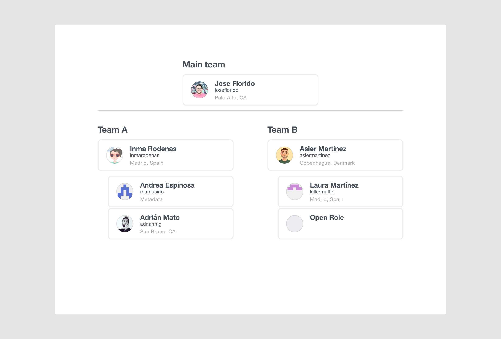
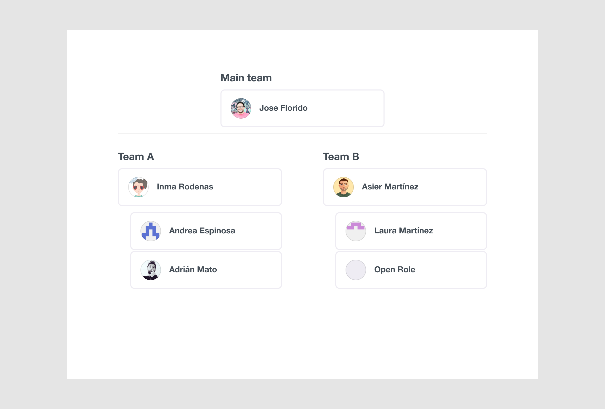
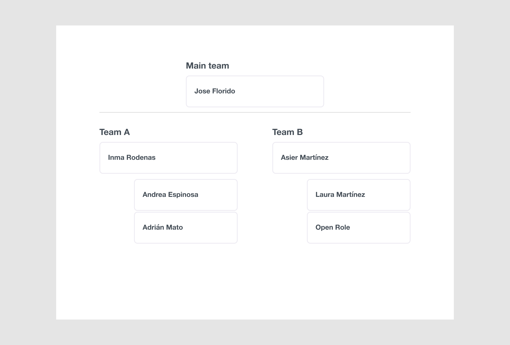

# Orgchart (a figma plugin)

Create an orgchart in figma from a JSON file.

## Run the plugin locally

TODO: Post the plugin to the Figma community. In the meantime, you can run the plugin locally:

- Clone the repository: `git clone https://github.com/mamuso/figma-orgchart.git`
- Go to the directory: `cd figma-orgchart`
- Install dependencies: `npm i`
- Build the plugin: `npm run watch`
- In the Figma desktop app, open a Figma document, and go to `Plugins > Development > Import plugin from manifest`
- Select the `figma-orgchart/manifest.json` file

If you run the plugin locally, you can edit `src/defautChartData.json` to change the default chart data.

## JSON data

https://jsoneditoronline.org/beta/#left=cloud.35c0637679714972b1d6e1db53e6008d

## Aditional configurations

By default, the plugin assumes the following configuration:

```json
{
  "avatar": true,
  "name": true,
  "alias": true,
  "meta": true,
  "ogurl": "https://github.com/",
  "color": {
    "border": "EEECF3",
    "background": "FFFFFF",
    "primarytext": "444D56",
    "secondarytext": "A1A6AA"
  },
  "text": {
    "label": { "family": "Helvetica Neue", "style": "Bold", "size": 20 },
    "name": { "family": "Helvetica Neue", "style": "Bold", "size": 16 },
    "alias": { "family": "Helvetica Neue", "style": "Regular", "size": 12 },
    "meta": { "family": "Helvetica Neue", "style": "Regular", "size": 12 }
  }
}
```

You can change the default configuration by addign a "config" key to the root of the JSON file. Check some of the examples below to learn how to change the configuration.

## Examples

### An orgchart with Avatar, Name, Alias and Meta

- [001-avatar-name-alias-meta-github.json](examples/001-avatar-name-alias-meta-github.json)



### Loading avatars from twitter

- [002-avatar-name-alias-meta-twitter.json](examples/002-avatar-name-alias-meta-twitter.json)


### Hide Alias field

- [003-avatar-name-github.json](examples/003-avatar-name-github.json)



### No name

- [004-name.json](examples/004-name.json)



### Loading avatars from URLs

- [005-custom-avatar.json](examples/005-custom-avatar.json)


